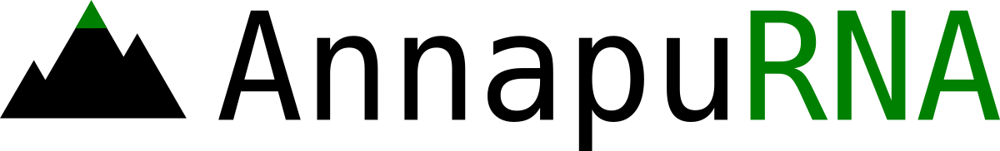
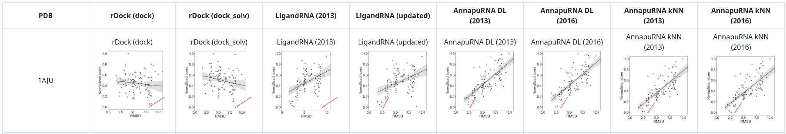

[AnnapuRNA scoring function](https://github.com/filipsPL/annapurna) - additional materials.

<!-- TOC START min:1 max:6 link:true asterisk:false update:true -->
- [Data from manuscript](#data-from-manuscript)
- [Training and testing datasets](#training-and-testing-datasets)
- [Correlation plots for described scoring functions](#correlation-plots-for-described-scoring-functions)
- [How to cite](#how-to-cite)
- [Contact](#contact)
<!-- TOC END -->


# Data from manuscript

:file_folder: directory: `data_from_manuscript/`

Here is deposited data described in the manuscript:
- `1-selected_examples` - selected examples from the test set

```
docking.rmsd        -- RMSD values
docking.score       -- score values from the docking program
annapurna.score     -- score values from AnnapuRNA
pymol-session.pse   -- PyMOL session with structures
```

- `2-case_study` - the files used in the study: RNA structures, best docking poses from rDock and selected by AnnapuRNA, the reference ligand coordinates; the PyMOL session with all results visualized.

# Training and testing datasets

:file_folder: directory: `docking/`

Please note, that some of the files are compressed with the [xz](https://en.wikipedia.org/wiki/XZ_Utils). To uncompress the file, just type `xz -d file.xz` or use [7-zip archiver](https://en.wikipedia.org/wiki/7-Zip).

- `datasets.csv` - definitions of 2013, 2016, and testing datasets


For each pdb the directory tree is as follows:

```
.
├── docking
│   └── dockprep                -- docking results
├── ligand                      -- ligand structures
│   ├── 3D-babel
│   ├── 3D-balloon
│   ├── 3D-PDB-idealized
│   ├── ligand.smi
│   └── native_conformation
└── rna
    └── dockprep                -- RNA structures
```

`docking/dockprep/` contains data for the native conformer and conformers generated with two different methods (OpenBabel and Balloon). Each "conformer" directory contains four subdirectories containing docking results for four docking programs:

```
.
├── 3D-babel
│   ├── AutodockVina
│   ├── iDock
│   ├── rdock-dock
│   └── rdock-dock_solv
├── 3D-balloon
│   ├── AutodockVina
│   ├── iDock
│   ├── rdock-dock
│   └── rdock-dock_solv
└── native_conformation
    ├── AutodockVina
    ├── iDock
    ├── rdock-dock
    └── rdock-dock_solv
```

each docking dir contains results of docking (in the main dir) and rescoring:

```
.
├── docking.rmsd
├── docking.score
├── docking.sdf.xz
├── docking.titles.sdf.xz
└── rescoring
    ├── annapurna_AD_1_2A.score
    ├── annapurna.score
    ├── ligandrna_basic.score
    ├── ligandrna_modern.score
    ├── rdock-dock.score
    ├── rdock-docksolv.score
    └── rfscore_vs_v2.score
```


# Correlation plots for described scoring functions

:file_folder: directory: `correlations/`

Correlation plots for described scoring functions are available in the [correlations/](correlations/) directory.



Please look at the md file or clone the repository and open html file in your browser.


# How to cite

Filip Stefaniak, Janusz M. Bujnicki, AnnapuRNA: a scoring function for predicting RNA-small molecule interactions, bioRxiv 2020.09.08.287136; doi: https://d

# Contact

Laboratory of Bioinformatics and Protein Engineering
International Institute of Molecular and Cell Biology in Warsaw
ul. Ks. Trojdena 4, 02-109 .Warsaw, Poland

Head of the Laboratory: Janusz M. Bujnicki iamb@genesilico.pl
