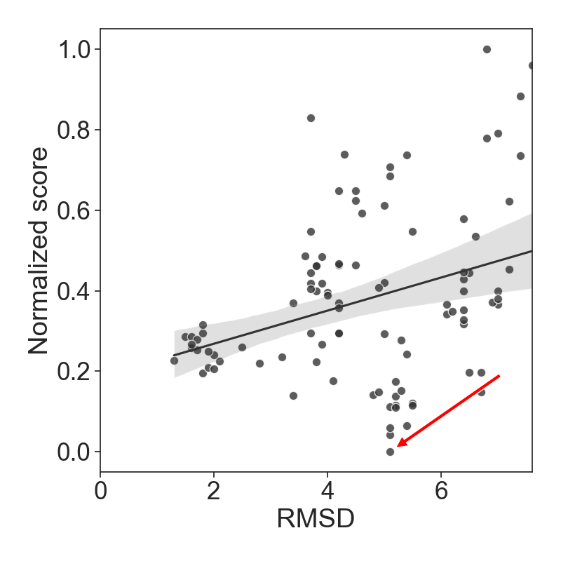
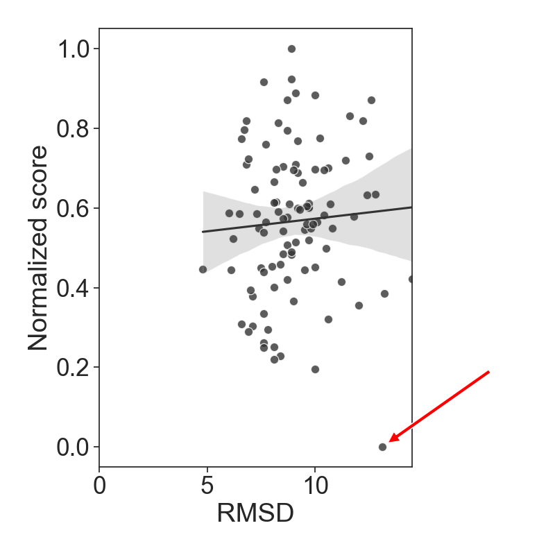
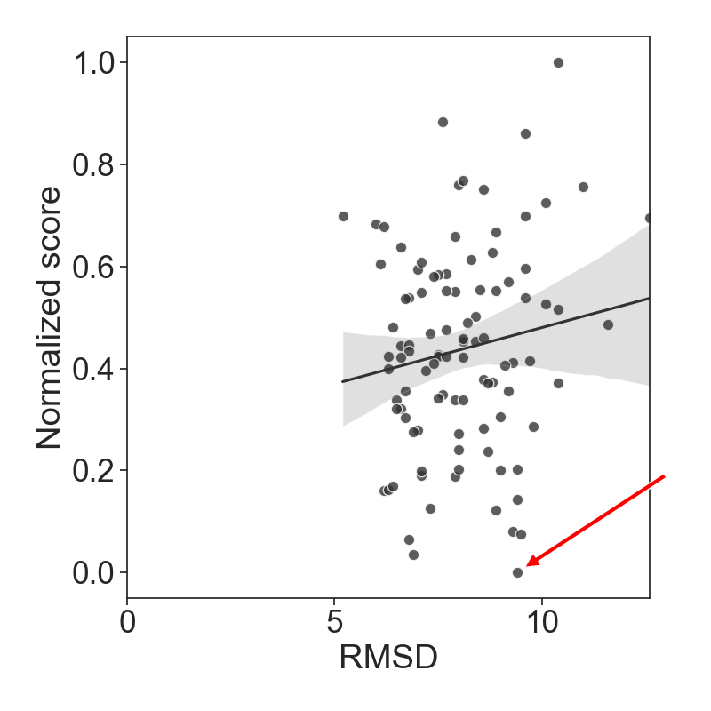
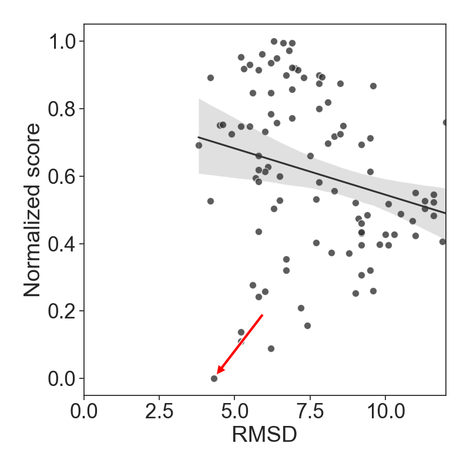
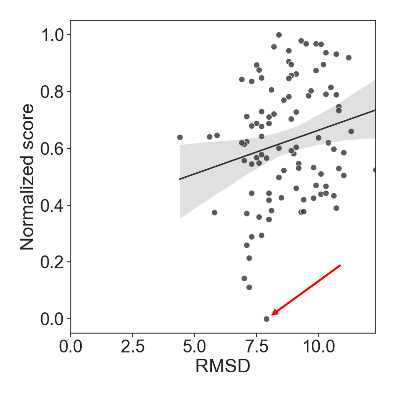
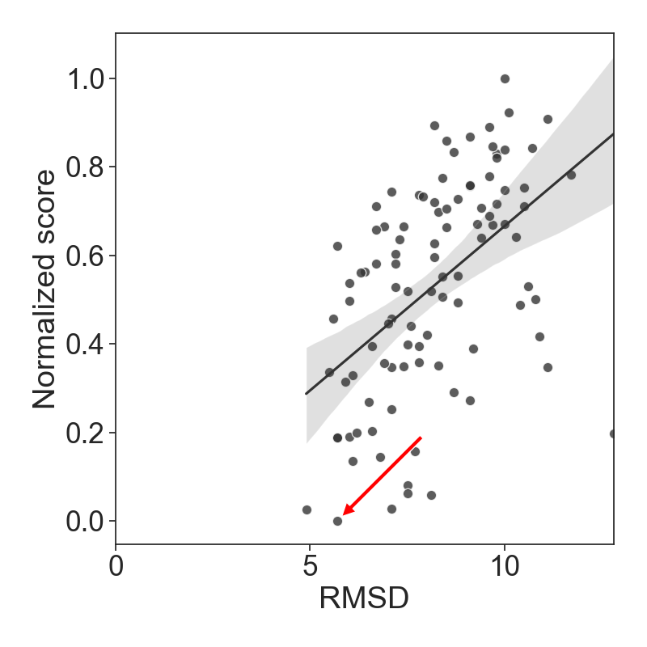
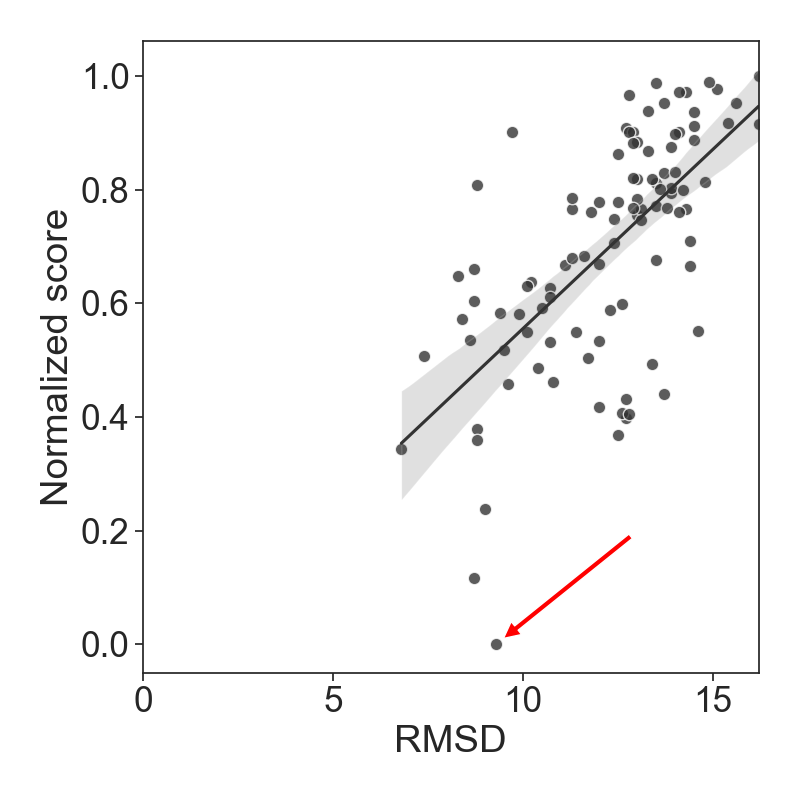
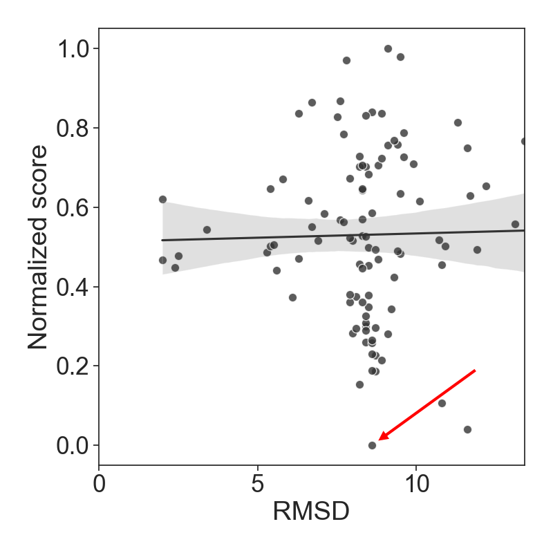
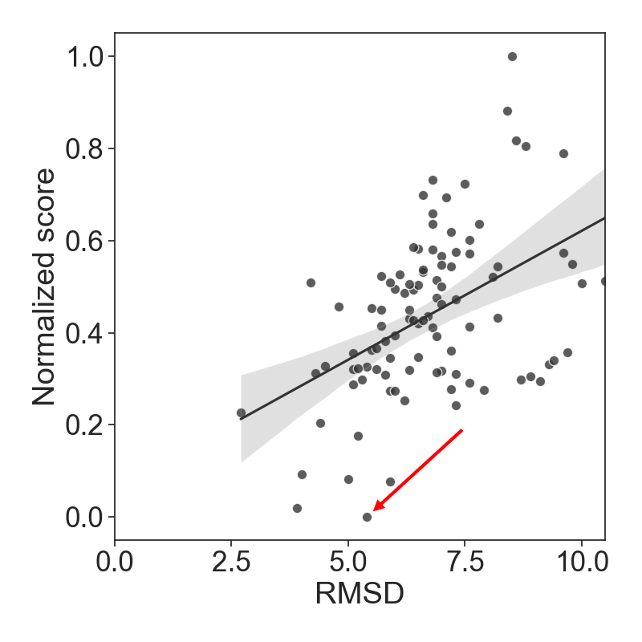
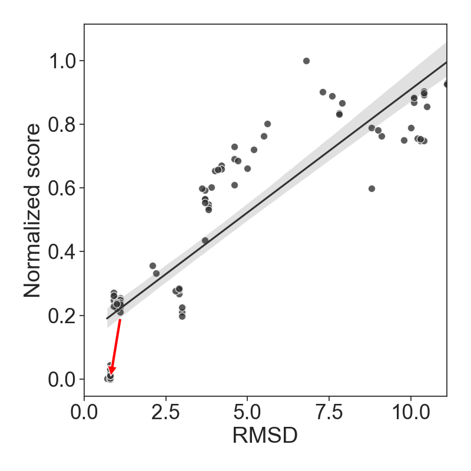

%Scatter plots for structures from the testing set
| PDB | rDock (dock)| rDock (dock_solv)| LigandRNA (2013)| LigandRNA (updated)| AnnapuRNA DL (2013)| AnnapuRNA DL (2016)| AnnapuRNA kNN (2013)| AnnapuRNA kNN (2016) |
 |:-------------:|:-------------:|:-------------:|:-------------:|:-------------:|:-------------:|:-------------:|:-------------:|:-------------:|
| 1AJU| rDock (dock)  | rDock (dock_solv)  | LigandRNA (2013)  | LigandRNA (updated)  | AnnapuRNA DL (2013)  | AnnapuRNA DL (2016)  | AnnapuRNA kNN (2013)  | AnnapuRNA kNN (2016)   |
| 1AM0| rDock (dock)  | rDock (dock_solv)  | LigandRNA (2013)  | LigandRNA (updated)  | AnnapuRNA DL (2013)  | AnnapuRNA DL (2016)  | AnnapuRNA kNN (2013)  | AnnapuRNA kNN (2016)   |
| 1BYJ| rDock (dock)  | rDock (dock_solv)  | LigandRNA (2013)  | LigandRNA (updated)  | AnnapuRNA DL (2013)  | AnnapuRNA DL (2016)  | AnnapuRNA kNN (2013)  | AnnapuRNA kNN (2016)   |
| 1EHT| rDock (dock)  | rDock (dock_solv)  | LigandRNA (2013)  | LigandRNA (updated)  | AnnapuRNA DL (2013)  | AnnapuRNA DL (2016)  | AnnapuRNA kNN (2013)  | AnnapuRNA kNN (2016)   |
| 1EI2| rDock (dock)  | rDock (dock_solv)  | LigandRNA (2013)  | LigandRNA (updated)  | AnnapuRNA DL (2013)  | AnnapuRNA DL (2016)  | AnnapuRNA kNN (2013)  | AnnapuRNA kNN (2016)   |
| 1FMN| rDock (dock)  | rDock (dock_solv)  | LigandRNA (2013)  | LigandRNA (updated)  | AnnapuRNA DL (2013)  | AnnapuRNA DL (2016)  | AnnapuRNA kNN (2013)  | AnnapuRNA kNN (2016)   |
| 1FYP| rDock (dock)  | rDock (dock_solv)  | LigandRNA (2013)  | LigandRNA (updated)  | AnnapuRNA DL (2013)  | AnnapuRNA DL (2016)  | AnnapuRNA kNN (2013)  | AnnapuRNA kNN (2016)   |
| 1J7T| rDock (dock)  | rDock (dock_solv)  | LigandRNA (2013)  | LigandRNA (updated)  | AnnapuRNA DL (2013)  | AnnapuRNA DL (2016)  | AnnapuRNA kNN (2013)  | AnnapuRNA kNN (2016)   |
| 1KOC| rDock (dock)  | rDock (dock_solv)  | LigandRNA (2013)  | LigandRNA (updated)  | AnnapuRNA DL (2013)  | AnnapuRNA DL (2016)  | AnnapuRNA kNN (2013)  | AnnapuRNA kNN (2016)   |
| 1KOD| rDock (dock)  | rDock (dock_solv)  | LigandRNA (2013)  | LigandRNA (updated)  | AnnapuRNA DL (2013)  | AnnapuRNA DL (2016)  | AnnapuRNA kNN (2013)  | AnnapuRNA kNN (2016)   |
| 1MWL| rDock (dock)  | rDock (dock_solv)  | LigandRNA (2013)  | LigandRNA (updated)  | AnnapuRNA DL (2013)  | AnnapuRNA DL (2016)  | AnnapuRNA kNN (2013)  | AnnapuRNA kNN (2016)   |
| 1NBK| rDock (dock)  | rDock (dock_solv)  | LigandRNA (2013)  | LigandRNA (updated)  | AnnapuRNA DL (2013)  | AnnapuRNA DL (2016)  | AnnapuRNA kNN (2013)  | AnnapuRNA kNN (2016)   |
| 1NEM| rDock (dock)  | rDock (dock_solv)  | LigandRNA (2013)  | LigandRNA (updated)  | AnnapuRNA DL (2013)  | AnnapuRNA DL (2016)  | AnnapuRNA kNN (2013)  | AnnapuRNA kNN (2016)   |
| 1PBR| rDock (dock)  | rDock (dock_solv)  | LigandRNA (2013)  | LigandRNA (updated)  | AnnapuRNA DL (2013)  | AnnapuRNA DL (2016)  | AnnapuRNA kNN (2013)  | AnnapuRNA kNN (2016)   |
| 1Q8N| rDock (dock)  | rDock (dock_solv)  | LigandRNA (2013)  | LigandRNA (updated)  | AnnapuRNA DL (2013)  | AnnapuRNA DL (2016)  | AnnapuRNA kNN (2013)  | AnnapuRNA kNN (2016)   |
| 1TOB| rDock (dock)  | rDock (dock_solv)  | LigandRNA (2013)  | LigandRNA (updated)  | AnnapuRNA DL (2013)  | AnnapuRNA DL (2016)  | AnnapuRNA kNN (2013)  | AnnapuRNA kNN (2016)   |
| 1UTS| rDock (dock)  | rDock (dock_solv)  | LigandRNA (2013)  | LigandRNA (updated)  | AnnapuRNA DL (2013)  | AnnapuRNA DL (2016)  | AnnapuRNA kNN (2013)  | AnnapuRNA kNN (2016)   |
| 1UUD| rDock (dock)  | rDock (dock_solv)  | LigandRNA (2013)  | LigandRNA (updated)  | AnnapuRNA DL (2013)  | AnnapuRNA DL (2016)  | AnnapuRNA kNN (2013)  | AnnapuRNA kNN (2016)   |
| 1UUI| rDock (dock)  | rDock (dock_solv)  | LigandRNA (2013)  | LigandRNA (updated)  | AnnapuRNA DL (2013)  | AnnapuRNA DL (2016)  | AnnapuRNA kNN (2013)  | AnnapuRNA kNN (2016)   |
| 1XPF| rDock (dock)  | rDock (dock_solv)  | LigandRNA (2013)  | LigandRNA (updated)  | AnnapuRNA DL (2013)  | AnnapuRNA DL (2016)  | AnnapuRNA kNN (2013)  | AnnapuRNA kNN (2016)   |
| 1XPF| rDock (dock)  | rDock (dock_solv)  | LigandRNA (2013)  | LigandRNA (updated)  | AnnapuRNA DL (2013)  | AnnapuRNA DL (2016)  | AnnapuRNA kNN (2013)  | AnnapuRNA kNN (2016)   |
| 1XPF| rDock (dock)  | rDock (dock_solv)  | LigandRNA (2013)  | LigandRNA (updated)  | AnnapuRNA DL (2013)  | AnnapuRNA DL (2016)  | AnnapuRNA kNN (2013)  | AnnapuRNA kNN (2016)   |
| 2ET8| rDock (dock)  | rDock (dock_solv)  | LigandRNA (2013)  | LigandRNA (updated)  | AnnapuRNA DL (2013)  | AnnapuRNA DL (2016)  | AnnapuRNA kNN (2013)  | AnnapuRNA kNN (2016)   |
| 2F4U| rDock (dock)  | rDock (dock_solv)  | LigandRNA (2013)  | LigandRNA (updated)  | AnnapuRNA DL (2013)  | AnnapuRNA DL (2016)  | AnnapuRNA kNN (2013)  | AnnapuRNA kNN (2016)   |
| 2F4U| rDock (dock)  | rDock (dock_solv)  | LigandRNA (2013)  | LigandRNA (updated)  | AnnapuRNA DL (2013)  | AnnapuRNA DL (2016)  | AnnapuRNA kNN (2013)  | AnnapuRNA kNN (2016)   |
| 2GDI| rDock (dock)  | rDock (dock_solv)  | LigandRNA (2013)  | LigandRNA (updated)  | AnnapuRNA DL (2013)  | AnnapuRNA DL (2016)  | AnnapuRNA kNN (2013)  | AnnapuRNA kNN (2016)   |
| 2O3X| rDock (dock)  | rDock (dock_solv)  | LigandRNA (2013)  | LigandRNA (updated)  | AnnapuRNA DL (2013)  | AnnapuRNA DL (2016)  | AnnapuRNA kNN (2013)  | AnnapuRNA kNN (2016)   |
| 2OE5| rDock (dock)  | rDock (dock_solv)  | LigandRNA (2013)  | LigandRNA (updated)  | AnnapuRNA DL (2013)  | AnnapuRNA DL (2016)  | AnnapuRNA kNN (2013)  | AnnapuRNA kNN (2016)   |
| 2OE5| rDock (dock)  | rDock (dock_solv)  | LigandRNA (2013)  | LigandRNA (updated)  | AnnapuRNA DL (2013)  | AnnapuRNA DL (2016)  | AnnapuRNA kNN (2013)  | AnnapuRNA kNN (2016)   |
| 2TOB| rDock (dock)  | rDock (dock_solv)  | LigandRNA (2013)  | LigandRNA (updated)  | AnnapuRNA DL (2013)  | AnnapuRNA DL (2016)  | AnnapuRNA kNN (2013)  | AnnapuRNA kNN (2016)   |
| 3D2X| rDock (dock)  | rDock (dock_solv)  | LigandRNA (2013)  | LigandRNA (updated)  | AnnapuRNA DL (2013)  | AnnapuRNA DL (2016)  | AnnapuRNA kNN (2013)  | AnnapuRNA kNN (2016)   |
| 3GX2| rDock (dock)  | rDock (dock_solv)  | LigandRNA (2013)  | LigandRNA (updated)  | AnnapuRNA DL (2013)  | AnnapuRNA DL (2016)  | AnnapuRNA kNN (2013)  | AnnapuRNA kNN (2016)   |
| 3SUX| rDock (dock)  | rDock (dock_solv)  | LigandRNA (2013)  | LigandRNA (updated)  | AnnapuRNA DL (2013)  | AnnapuRNA DL (2016)  | AnnapuRNA kNN (2013)  | AnnapuRNA kNN (2016)   |
